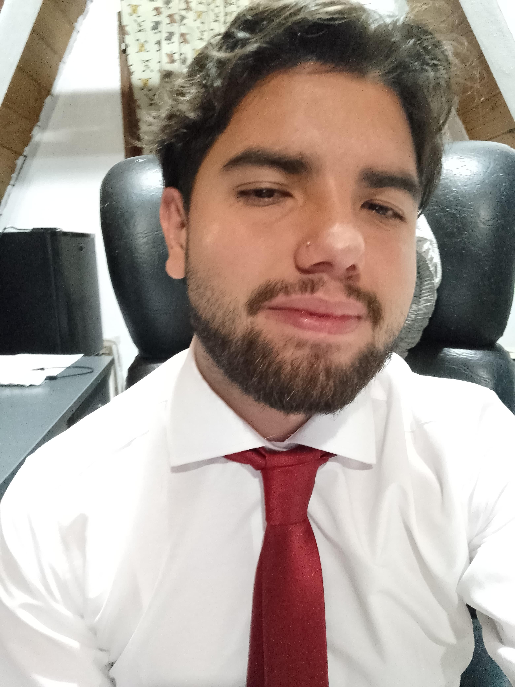

Diego Brauer 
---
Hola, me llamo Diego, actualmete estoy cursando el segundo cuatrimestre de la Tecnicatura Universitaria en Programacion. Decidi anotarme a esta carrera a principios de 2023 ya que siempre fui una persona que se le dio bien la computacion y quiero dedicarme a programar. Hoy en dia me estoy enfocando en terminar la carrera y a la par estoy aprendiendo desarrollo web de forma autodidacta para poder conseguir mi trabajo en IT.

Mis gustos
---
1.Programar💻  
2.Cocinar🍳   
3.Natacion🏊‍♂️  
4.Leer📖  
